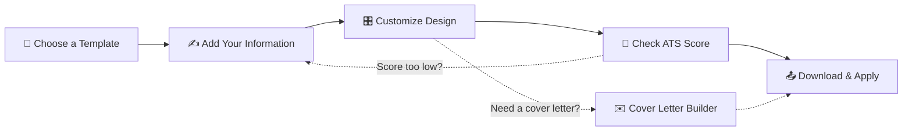

<table width="100%">
<tr>
<td width="15%" align="center">

</td>
<td width="70%" align="center">

</td>
<td width="15%" align="center">

</td>
</tr>
</table>

<div align="center">

<h3>Build a Resume. Build Your Future.</h3>


<br/>

<a href="https://shahrishabh1513-jsk.github.io/RT-resume-builder/"></a>
<a href="https://github.com/shahrishabh1513-jsk/RT-resume-builder"></a>
<a href="https://github.com/shahrishabh1513-jsk/RT-resume-builder/stargazers"></a>

<br/>


<br/>


</div>

<br/>

<table align="center">
<tr>
<td align="center" width="20%"><sub>TEMPLATES</sub><br><b>4 Original</b></td>
<td align="center" width="20%"><sub>CONTENT SECTIONS</sub><br><b>13</b></td>
<td align="center" width="20%"><sub>COST</sub><br><b>$0 Free</b></td>
<td align="center" width="20%"><sub>EXPORT</sub><br><b>PDF · TXT · JSON</b></td>
<td align="center" width="20%"><sub>DATA</sub><br><b>Stays On Device</b></td>
</tr>
</table>

<div align="center">

[](#-live-preview)
[](#-about-the-project)
[](#-key-features)
[](#-site-map)
[](#-how-it-works)
[](#️-tech-stack)
[](#-folder-structure)
[](#-getting-started)
[](#-connect)

</div>

<div align="center"></div>

## 🔍 Live Preview

<div align="center">
<a href="https://shahrishabh1513-jsk.github.io/RT-resume-builder/" target="_blank">

</a>

<sub>👆 Click to explore the live app</sub>

<br/>

<a href="https://shahrishabh1513-jsk.github.io/RT-resume-builder/" target="_blank">
  
</a>

</div>

<div align="center"></div>

## 📖 About The Project

**RT Resume Builder** is a fully client-side **resume building web app** that helps job seekers create professional, ATS-friendly resumes in minutes — with modern templates, smart writing guidance, and a live preview that updates as you type.

Everything runs entirely in the browser. There's no sign-up, no backend, and no data leaving your device — resumes are saved locally and exported as PDF, plain text, or a JSON backup whenever you want.

> 💬 *"Build a resume that gets noticed."*

<div align="center">

| | |
|---|---|
| 📄 **Type** | Client-side Resume Builder Web App |
| 🎯 **Built For** | Job seekers who need a fast, clean, ATS-ready resume |
| 🔒 **Privacy** | No account required — all data stays on your device |
| 🧠 **Standout Feature** | Built-in ATS Checker with a live Resume Score |
| 📤 **Export** | PDF · TXT · JSON backup |

</div>

<div align="center"></div>

## ✨ Key Features

<table>
<tr>
<td width="50%" valign="top">

### 📄 Resume Building
- 🎨 **4 original templates** — genuinely different layouts, not one recolored
- ⚡ **Live preview** updates on every keystroke
- 🗂️ **13 content sections** for full coverage
- 🖱️ **Drag-and-drop** section reordering, hiding & custom sections

</td>
<td width="50%" valign="top">

### 🎯 ATS Optimization
- ✅ **ATS-friendly formatting** — clean structure, standard headings
- 📊 **Resume Score** analyzer with category breakdowns
- 🔑 **Keyword matching** against a target job description
- ⚠️ Flags missing contact info, weak bullets & empty sections

</td>
</tr>
<tr>
<td width="50%" valign="top">

### 🧠 Smart Guidance
- 💡 **Role-based writing suggestions** for summaries & bullets
- 📝 **Cover Letter Builder** with a matching design system
- 🎛️ Live customization — color, font, spacing & section order
- 📑 **Multiple resumes** for different roles, saved separately

</td>
<td width="50%" valign="top">

### 📤 Export & Privacy
- 🖨️ **PDF export** with selectable text (ATS-parsable)
- 📃 **TXT export** for plain-text applications
- 💾 **JSON backup** for full portability
- 🔒 **100% local** — no server, no account, no tracking

</td>
</tr>
</table>

<div align="center"></div>

## 🗺️ Site Map

<div align="center">

| Page | Description |
|:---:|---|
| 🏠 **Home** (`index.html`) | Landing page, feature highlights & how-it-works |
| 🎨 **Templates** (`templates.html`) | Browse all four resume templates |
| 🛠️ **Resume Builder** (`builder.html`) | Main editor with live preview |
| 🎯 **ATS Checker** (`ats-checker.html`) | Resume Score & keyword analysis |
| ✉️ **Cover Letter** (`cover-letter.html`) | Matching cover letter builder |
| 📁 **My Resumes** (`dashboard.html`) | Saved resumes dashboard |

</div>

<div align="center"></div>

## 🧭 How It Works



<div align="center">

**01** Choose a template &nbsp;→&nbsp; **02** Add your information &nbsp;→&nbsp; **03** Customize your design &nbsp;→&nbsp; **04** Download & apply

</div>

<div align="center"></div>

## 🛠️ Tech Stack

<div align="center">

| Category | Technology | Purpose |
|:---:|:---:|:---|
| **Markup** |  | Semantic page structure |
| **Styling** |  | Templates, theming & responsive layouts |
| **Interactivity** |  | Live preview, ATS scoring, drag-and-drop |
| **Storage** |  | Local resume persistence, no backend |
| **Version Control** |   | Source control |
| **Deployment** |  | Live hosting |

</div>

<div align="center"></div>

## 📂 Folder Structure

<details>
<summary><b>Click to expand the folder structure 📁</b></summary>

```bash
RT-resume-builder/
│
├── assets/
│   ├── logo.svg                      # RT Resume Builder logo
│   └── icons/                          # UI icons
│
├── index.html                            # Home / landing page
├── templates.html                          # Template gallery
├── builder.html                              # Resume builder & live preview
├── ats-checker.html                            # ATS score & keyword checker
├── cover-letter.html                             # Cover letter builder
├── dashboard.html                                  # Saved resumes dashboard
│
├── css/
│   ├── style.css                                      # Global styles
│   └── templates.css                                    # Resume template styles
│
├── js/
│   ├── builder.js                                          # Editor & live preview logic
│   ├── templates.js                                          # Template rendering
│   ├── ats-checker.js                                          # Resume scoring logic
│   ├── storage.js                                                # localStorage persistence
│   └── export.js                                                   # PDF / TXT / JSON export
│
└── README.md                                                           # Project documentation
```

</details>

<div align="center"></div>

## 🚀 Getting Started

### Option 1 — Use the live version

No setup needed 👉 **[Open RT Resume Builder](https://shahrishabh1513-jsk.github.io/RT-resume-builder/)**

### Option 2 — Run it locally

```bash
# 1️⃣ Clone the repository
git clone https://github.com/shahrishabh1513-jsk/RT-resume-builder.git

# 2️⃣ Navigate into the project directory
cd RT-resume-builder

# 3️⃣ Serve it locally (recommended, so localStorage behaves consistently)
python -m http.server 8000
```

Then open `http://localhost:8000` in your browser.

✅ No build tools, dependencies, or installations required — it's a pure **HTML/CSS/JS** project.

<div align="center"></div>

## 🔒 Data & Privacy

All resume data is stored **locally in your browser** — there is no backend server and no account system.

- ✅ No sign-up required, works offline once loaded
- ✅ Nothing is ever sent to any server
- ⚠️ Clearing browser data will erase saved resumes — export a JSON backup regularly
- ⚠️ Resumes don't sync across devices or browsers (by design)

> ℹ️ The Resume Score is a **local, simulated ATS analysis** — a helpful guide, not a real employer's applicant tracking system.

<div align="center"></div>

## 🧭 Roadmap

- [x] Four original ATS-friendly templates
- [x] Live preview with drag-and-drop sections
- [x] ATS Checker with Resume Score
- [x] PDF, TXT & JSON export
- [x] Cover letter builder
- [ ] ☁️ Optional cloud sync across devices
- [ ] 🌐 More template designs
- [ ] 🌙 Dark mode
- [ ] 🗣️ Multi-language resume support

<div align="center"></div>

## 🤝 Connect

<div align="center">

**Rishabh Alpeshabhai Shah**

<a href="https://rishabh-shah-portfolio.netlify.app/"></a>
<a href="https://www.linkedin.com/in/rishabh-alpeshabhai-shah-91b9072a6/"></a>
<a href="mailto:shahrishu1515@gmail.com"></a>
<a href="https://github.com/shahrishabh1513-jsk"></a>

</div>

---

<div align="center">

### ⭐ If this helped you land an interview, give it a star!


<br/>

**Made with 📄 & 💙 by Rishabh Shah**


</div>
